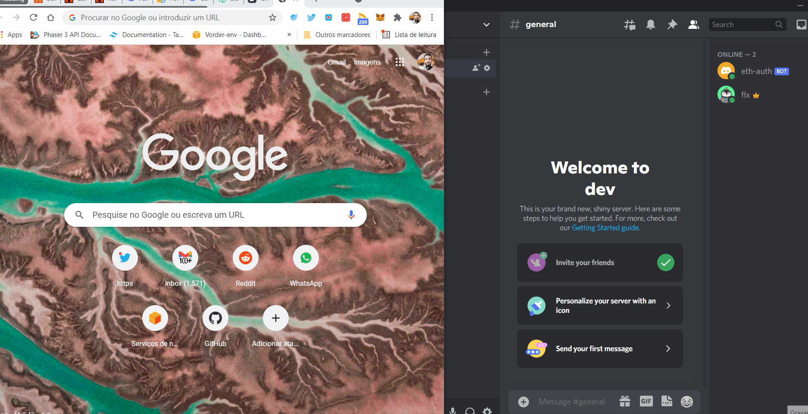
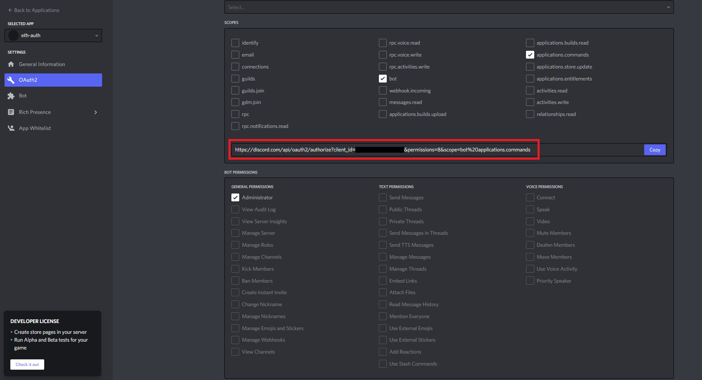

# Discord Ethereum Authentication 

A Discord bot that enables you to authenticate users with Ethereum. The infrastructure is fully serverless and based on [AWS Lambda](https://aws.amazon.com/pt/lambda/).

The bot is based on:
1. [austintgriffith/scaffold-eth/serverless-auth](https://github.com/austintgriffith/scaffold-eth/tree/serverless-auth) to handle the Ethereum authentication flow.
2. [ytausch/serverless-discord-bot](https://github.com/ytausch/serverless-discord-bot) for the interaction with  Discord  through slash commands.

Donations
========
If you find this repository useful, any ETH, NFT, or other tokens are greatly appreciated.
ETH Address: `0xa8624937a437F53382d4B48f1AE13E0CF5C9F8cB`

Contents
========
 * [Requirements](#prerequisites)
 * [Setup](#setup)
 * [Usage](#usage)
 * [Future improvements](#future-improvements)

### Prerequisites
---

- A Discord account and a server where you're an administrator
- AWS Account with console and programmatic access
- A domain name registered with AWS
- Local AWS credentials profile
- Node version 14
- [SAM CLI](https://docs.aws.amazon.com/serverless-application-model/latest/developerguide/serverless-sam-cli-install.html)

### Setup
---
##### Discord
- Create a Discord server if you don't have one already. Create the role you want to give the user after they've authenticated with Ethereum. For example, I named my role _eth-authenticated_. __Important__: this role must be below in the hierarchy than the one for the bot you create in the next step, otherwise you'll get a _missing access_ error. See [here](https://support.discord.com/hc/en-us/articles/214836687-Role-Management-101) how to move a role up or down in the hierarchy.
- [Set up an application for your bot](https://discordjs.guide/preparations/setting-up-a-bot-application.html#creating-your-bot)
- Select the following boxes in the OAuth2 tab. Open the link marked in red and choose your server to add the bot.

##### AWS

###### IAM User Credentials
- Create an access key pair for your AWS user as explained [here](https://www.youtube.com/watch?v=JvtmmS9_tfU) (this user must have administrator access).
- Create file `.aws/credentials` with the same structure as `.aws/credentials.example` (including the "[scaffold-eth]" part), and fill in the parameters `aws_access_key_id` and `aws_secret_access_key` with the values you obtained from the previous step.

###### Certificate for the API endpoint

- Create a certificate in [Certificate Manager](https://aws.amazon.com/pt/certificate-manager/) for the API endpoint you'll later deploy to be linked to. For instance, mine is at dev.api.vorder.io. Don't forget to add the DNS record to your domain as mentioned in the verification prompt that shows up once you create the certificate. You won't be able to deploy the __Ethereum Authentication Infrastructure__ correctly without the certificate Status showing up as _Issued_, so wait for it to complete before doing that part.

###### Secrets Manager
All the secrets necessary for the bot to run are retrieved from an [AWS Secrets Manager](https://aws.amazon.com/secrets-manager/) secret named `/dev/serverless_discord_bot/discord` you have to create that secret manually before deploying the stack. When creating the secret choose the option _Other type of secrets_.

The secret must contain the following key/value pairs:
- `app_id`, from the application you've created in the Discord Setup.
- `public_key`, from the application you've created in the Discord Setup.
- `bot_token`, from the application you've created in the Discord Setup.
- `server_id`- Right-click your server on Discord and select __Copy ID__ to get this.
- `channel_id`. Right-click your channel on Discord and select __Copy ID__ to get this.
- `role_id`. Right-click the role you've created in the Discord setup and select __Copy ID__ to get this. You can see your server's roles by right-clicking your server > __Server Settings__ > __Roles__.
- `jwt_secret`. This is the secret which will be used to encode/decode the authentication JWTs. Anything works here, but choose something strong enough.

##### Discord Interaction Infrastructure
We'll now go through the deployment of the infrastructure responsible for interacting with Discord. This includes creating the slash-command and handling the role assignment when a user is successfuly authenticated. 

- `cd` into _packages/discord-interaction/src/commands_layer/nodejs_ and install the layer dependencies using `npm install`. This is the only install required for this infrastructure. The rest is auto-installed by SAM.
- `cd` back into _packages/discord-interaction/_ and do `sam build`. Once the build is complete do `sam deploy --guided` and choose the following parameters:

    > Stack Name [dev-discord-interaction]: dev-discord-interaction

    > AWS Region [us-east-2]: us-east-2

    > #Shows you resources changes to be deployed and require a 'Y' to initiate deploy

    > Confirm changes before deploy [y/N]: n

    > #SAM needs permission to be able to create roles to connect to the resources in your template

    > Allow SAM CLI IAM role creation [Y/n]: y

    > DiscordHandlerFunction may not have authorization defined, Is this okay? [y/N]: y

    > Save arguments to configuration file [Y/n]: y

    > SAM configuration file [samconfig.toml]: samconfig.toml

    > SAM configuration environment [default]: default

- Once the deployment is complete copy the __API Gateway endpoint URL__ stack output and paste it in the Discord Developer Portal as __Interactions Endpoint URL__.  If Discord was able to successfuly ping our Lambda you'll get a message saying "_All your edits have been carefully recorded_" at the top of the screen.
- Check that you now have a stack called _dev-discord-interaction_ in Cloudformation. Cross your fingers 🤞 and call the command `/eth-auth` in your Discord channel. If everything went right with the deploy, the bot should respond with a URL.

##### Ethereum Authentication Infrastructure
Now let's deploy the API that will talk to the front-end and handle the Ethereum authentication flow.

- In the root folder run `yarn install`. You'll get quite a lot of warnings regarding workspace dependencies, but those are harmless. Note: All the packages for this infrastructure (and also for the front-end and the chain) are installed through `yarn` workspaces. The __api__ package dependencies will later be installed using `npm`.

###### DynamoDB infrastructure
- `cd` into _packages/serverless-infrastructure_ and run `npm run deploy`. After this runs, you should now have a stack called _dev-scaffold-eth-infra-dynamodb_ in Cloudformation.

###### Authentication API infrastructure
- `cd` into _packages/api_ and install the dependencies using `npm install`.
- Change the URL that will be linked to your API in the following files - this is the same URL that you've created the Certificate above for, e.g. for me it's dev.api.vorder.io (I probably should have put this in an environment variable but oh well):
  1. In the file _packages/api/serverless.yml_, change the variable __domainName__ so that it matches your URL. __${self:custom.stage}__ is set to _dev_ by default already.
  2. In the file _packages/react-app/src/util_ change __baseUrl__ to that same URL so that the front-end knows where the API is located.
- Link your API to the URL by running `npx serverless create_domain`.
- Finally, deploy the infrastucture using `npm run deploy`. 

### Usage

In the root folder run in two separate command prompts:
- `yarn react-app:start` to start the local react app server.
- `yarn chain` to start the local chain server. Note: This example runs with a local chain, but you can set the chain to whatever you want. Just edit the variable __targetNetwork__ in _packages/react-app/src/App.jsx_ to change to a different chain.

Once the the local react app and chain servers are ready all is set up to try the bot.

1. Call the command `/eth-auth` in the channel.
2. Click the link that the bot gives you.
3. Click the login button at the upper right corner and login into your metamask wallet (note: you'll probably have to change the network on metamask to localhost).
4. Once you've logged in, click the __Authenticate__ button. You're prompted by metamask for a signature. After you provide the signature, if all went well, you'll receive a message from the bot saying that you've been sucessfully authenticated and you should now have the new role attributed to you in the Discord server.

### Future Improvements
---
- Remove hardcoding for `server_id` and `channel_id`, and make them dynamic depending on the server the bot is responding to.
- The set up has quite a lot of steps and streamlining it further would be ideal.
- Using SAM for the deployment of all the serverless infrastructure would be best. I developed this project for an hackathon and had limited time, so had to work with the repos I had available. If there's interest I'll port the API infrastructure to SAM.
- After the authentication there are many possibilities to what can be done. For example you might wish to check what balance the user has in their wallet or check which tokens they have for some specific purpose.